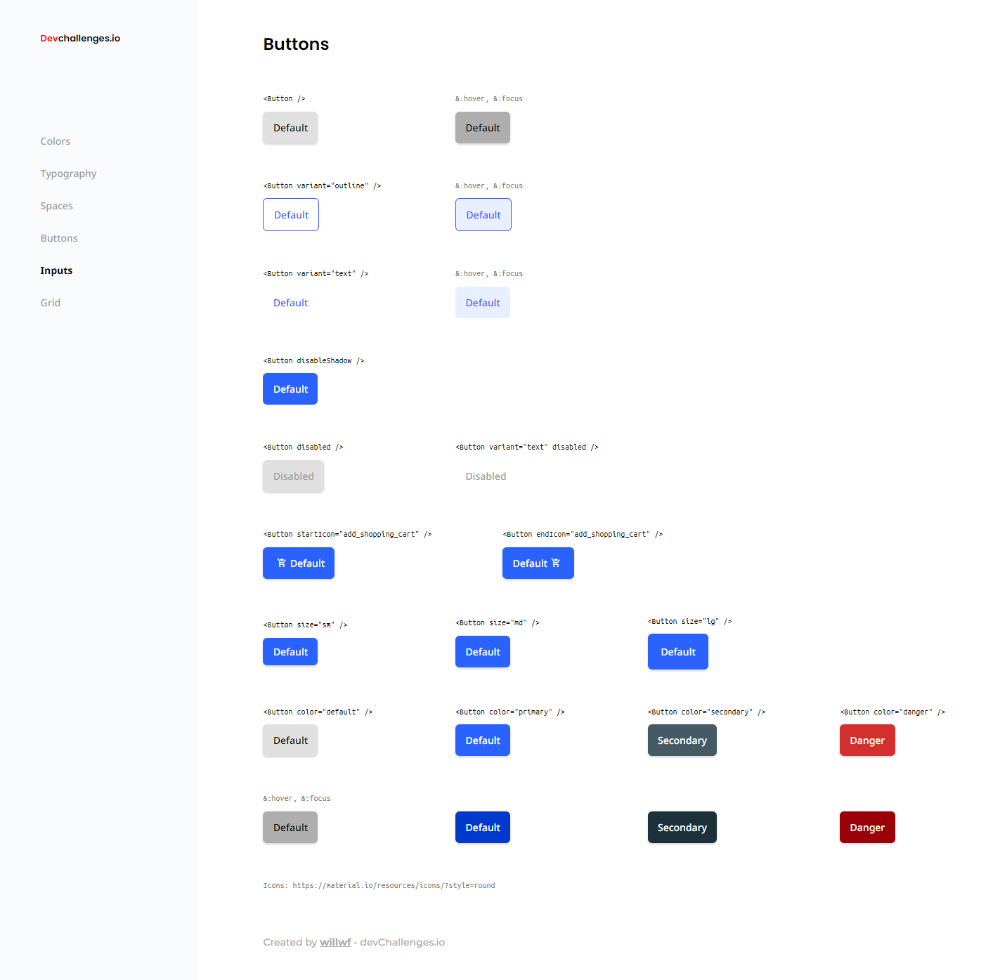

# Button component

This is a solution to the [Button Component Challenge on DevChallenges.io](https://devchallenges.io/challenges/ohgVTyJCbm5OZyTB2gNY).
## Overview

Challenge: Create a reusable button with all the states in the design and a page displaying all the states. You can work on the same project with other design system challenges. Use Front-end libraries like React or Vue. Fulfill user stories below:

- User story: I can see different button types: default, outline and text
- User story: I can choose to disable box-shadow
- User story: I can choose to disable the button
- User story: I can choose to have an icon on the left or right (Use Google Icon and at least 5 variants)
- User story: I can have different button sizes
- User story: I can have different colors
- User story: When I hover or focus, I can see visual indicators
- User story: I can still access all button attributes
- User story (optional): Show button in a similar way like the design or use Storybook. Otherwise, showing the button in multiple states is enough

Icons: https://google.github.io/material-design-icons/
## Screenshots

## What I Learned

This was a very interesting project. I've been able to create and style a button component and learn some things that I was sure that I knew, but I was wrong. There's is always something new to learn. With this button component you can create a lot of different buttons only passing a few attributes to change the appearance. It is very simples but it can save some time when styling your page.
## Stack utilizada

**Front-end:**
- Flexbox
- React
- Css Modules
- Semantic HTML5 markup
- [Vite.js](https://vitejs.dev/) - Bundler JS
## 🔗 Links

## Autores

- [@Willwf](https://www.github.com/Willwf)

